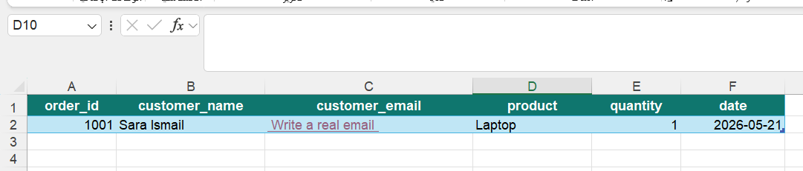
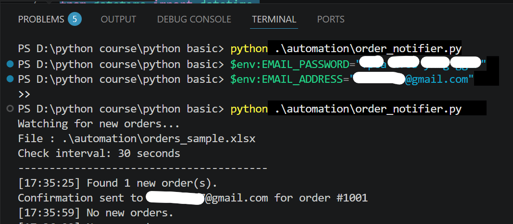
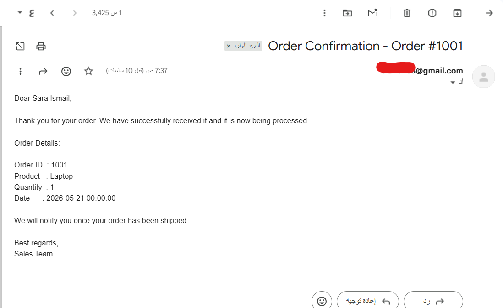

# Excel Email Order Automation

A Python automation project that reads new orders from an Excel file and sends automatic confirmation emails to customers.

Part of the **Code More, Watch Less** automation series.

---

## Project Goal

The goal of this project is to automate the process of checking new orders in an Excel file and sending confirmation emails manually.

The script reads the Excel file, detects new orders, sends an email to the customer, and saves the processed order ID to avoid duplicate emails.

---

## How It Works

1. Add a new order to the Excel file.
2. Run the Python script.
3. The script checks for new orders every 30 seconds.
4. If a new order is found, it sends a confirmation email.
5. The order ID is saved in `sent_orders.txt`.

---

## Excel File Format

The Excel file should contain these columns:

```text
order_id
customer_name
customer_email
product
quantity
date
```

Example:

```text
1001 | Ahmed Ali | ahmed@example.com | Laptop | 1 | 2024-01-15
```



---

## Features

- Reads orders from Excel
- Detects new orders automatically
- Sends confirmation emails using Gmail SMTP
- Prevents duplicate emails
- Uses environment variables for email credentials
- Checks the file every 30 seconds

---

## Project Structure

```text
excel-email-order-automation/
│
├── order_notifier.py
├── orders_sample.xlsx
├── README.md
├── .gitignore
├── excel-orders.png
├── terminal-success.png
└── email-result.png
```

---

## Requirements

Install the required packages:

```bash
pip install pandas openpyxl
```

---

## Gmail App Password Setup

This project uses Gmail SMTP to send emails.

You should not use your normal Gmail password.  
Instead, create a **Gmail App Password**.

To create one:

1. Open your Google Account.
2. Go to **Security**.
3. Enable **2-Step Verification**.
4. Go to **App Passwords**.
5. Create a new App Password.
6. Copy the generated password.

The app name can be anything, for example:

```text
Python Order Notifier
```

The name is only for organization and does not affect the code.

---

## Set Email Credentials

Do not write your email or App Password inside the code.

Use environment variables instead.

For Windows PowerShell:

```powershell
$env:EMAIL_ADDRESS="your_email@gmail.com"
$env:EMAIL_PASSWORD="your_app_password"
```

The code reads them using:

```python
SENDER_EMAIL = os.environ.get("EMAIL_ADDRESS")
SENDER_PASSWORD = os.environ.get("EMAIL_PASSWORD")
```

---

## How to Run

After setting the email credentials, run:

```bash
python order_notifier.py
```

If the script is inside a folder:

```bash
python .\automation\order_notifier.py
```

---

## Expected Output

When the script starts:

```text
Watching for new orders...
File : .\automation\orders_sample.xlsx
Check interval: 30 seconds
```

When an email is sent:

```text
Found 1 new order(s).
Confirmation sent to customer@gmail.com for order #1001
```



---

## Email Result

The customer receives an email with:

- Customer name
- Order ID
- Product
- Quantity
- Order date



---

## Testing

To test the project:

1. Open `orders_sample.xlsx`.
2. Add an email address you can access.
3. Run the script.
4. Check your inbox.
5. Add a new row with a new `order_id`.
6. Wait 30 seconds.

To test the same order again, change the `order_id` or delete `sent_orders.txt`.
